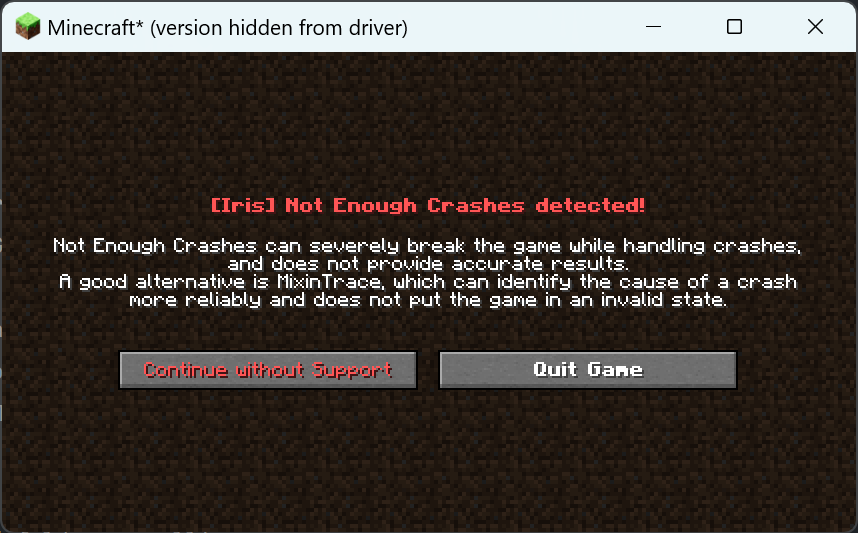

# Na, No OptiFine (NANO)

The definitive Fabric performance modpack that aims to eliminate the need for OptiFine, **FOREVER**.

Note: 1.16.5 to 1.18.2 packs will release eventually... life is too busy :(

## What is [OptiFine](https://www.optifine.net/home) & [Sodium](https://modrinth.com/mod/sodium)?

OptiFine is a very popular optimization mod that helps improve Minecraft's performance, and adds extra features that the vanilla client doesn't have. However, even while being a
performance mod, it's still very sluggish.

* E.G. Booting up the game or even changing resource packs takes foreverrrrrr...

Furthermore, the closed-source nature and intrusive characteristics of OptiFine pose challenges for other developers aiming to produce mods that are compatible with it.

Sodium is the free & open-source alternative to OptiFine that actually has **better performance**, and is compatible with a wide range of the Fabric mod ecosystem.
However, by itself, it lacks many of the beloved features from OptiFine, such as a zoom key, shader support, dynamic lighting, extreme customization with resource packs, etc.,
which can make transitioning out of OptiFine very difficult.

## So What Does This Modpack Do?

#### `Modpack Revision: 2`

Changes from Revision 1:

* Added [fast-ip-ping](https://modrinth.com/mod/fast-ip-ping)
* Added [Noxesium](https://modrinth.com/mod/noxesium)
* Moved [Remove Reloading Screen](https://modrinth.com/mod/rrls) to Optional Mods as it bugs out Replay Mod when exporting
* Removed [Better Beds](https://modrinth.com/mod/better-beds) because it does not render beds properly (plus it doesn't do much)

By using [the following mods](#mod-list), we're able to incorporate ALL of OptiFine's features, while still using Sodium! In addition, there are some quality of life
features & changes that enhance the Minecraft experience. However, the aim of this modpack is to stay as close to the "vanilla OptiFine" Minecraft experience as possible. This
means that there are no mods that add content or change core game mechanics. It's just cloning the OptiFine experience, but making it better!

* The mods in this modpack are categorized into [Performance](#performance), [OptiFine Features](#optifine-features), [Utility](#utility), [Extra Features](#extra-features),
  and [Libraries](#libraries).
* There are [Optional Mods](#optional) included in each release, and you can pick and choose which one you'd like to use.

#### Quick Note

This modpack is actually the personal modpack I use, and I thought it'd be a good idea to share it properly on GitHub so everybody else can use it! (It also makes it easier
for me to force it down my friends' throats 😅). Hope you guys enjoy it.

## How to Install & Use

`This is for the Vanilla Minecraft Launcher`

1. [Download Fabric](https://fabricmc.net/use/installer/) & install the Minecraft version you'd like to use.
2. [Download NANO](https://github.com/SirDanielIII/NANO/releases/). **Make sure the version you install corresponds with the correct Minecraft version!**
3. Unzip the file. (If you don't know how to do this... please Google it).
4. Locate the folder that Minecraft resides in, and go into the `mods` folder.
    * If there's no `mods` folder, just create it in the Minecraft directory.
    * If you need help locating the Minecraft folder, see [Windows](#windows) & [macOS](#macos).
5. DELETE ANY PREVIOUS MODS CURRENTLY IN THE `mods` FOLDER, OR MOVE THEM INTO A FOLDER INSIDE SO THEY'RE OUT OF THE WAY.
6. Copy & paste the JARs from the NANO folder into mods
    * Make sure the JARs are sitting in `mods` and not a folder inside `mods`!
    * Don't forget to copy-paste any JARs from NANO's "Optional" folder as well!
    * Ignore the following folders if they're present: `autotip` `memory_repo`
7. Open the Minecraft Launcher
8. Select the Fabric profile you want to run (E.G. fabric-loader-1.19.4) and press play!
    * [Optional] You can give your Minecraft profile more RAM. To do this, find the profile you want to edit in the "Installations" tab. Then click on the three dots to the right,
      then edit. Finally, change the number in `Xmx2G` to something like `Xmx6G` if you'd like to give Minecraft 6GB of RAM.
9. If Minecraft launches, and you get this message, just continue and ignore it:
   

### Windows

1. Press `Windows + R`, type `%appdata%` and press enter.
2. Go into the `.minecraft` folder.

### macOS

1. On your desktop, click on `Go` and press `Computer`.
2. Click into your storage drive.
3. Navigate: `Users → [Your Username] → Library → Application Support → minecraft`

## Mod List

`✅ → Included` `🟡 → Not Included (awaiting update)` `❌ → Not Included`

### Performance

These mods aim towards making your FPS go brrrr.

| Name                                                        | Author                                                       | 1.16.5 | 1.17.1 | 1.18.2 | 1.19.4 | 1.20.1 | 1.20.2 | Description                                                                                                                    |
|-------------------------------------------------------------|--------------------------------------------------------------|--------|--------|--------|--------|--------|--------|--------------------------------------------------------------------------------------------------------------------------------|
| [Enhanced Block Entities](https://modrinth.com/mod/ebe)     | [FoundationGames](https://modrinth.com/user/FoundationGames) | ✅      | ✅      | ✅      | ✅      | ✅      | ✅      | Increase the performance of block entity rendering.                                                                            |
| [Entity Culling](https://modrinth.com/mod/entityculling)    | [tr7zw](https://modrinth.com/user/tr7zw)                     | ✅      | ✅      | ✅      | ✅      | ✅      | ✅      | Using async path-tracing to skip rendering Block/Entities that are not visible.                                                |
| [FerriteCore](https://modrinth.com/mod/ferrite-core)        | [malte0811](https://modrinth.com/user/malte0811)             | ✅      | ✅      | ✅      | ✅      | ✅      | ✅      | This mod reduces the memory usage of Minecraft.                                                                                |
| [ImmediatelyFast](https://modrinth.com/mod/immediatelyfast) | [RaphiMC](https://modrinth.com/user/RaphiMC)                 | ❌      | ❌      | ✅      | ✅      | ✅      | ✅      | Improves the immediate mode rendering performance of the Minecraft client.                                                     |
| [Indium](https://modrinth.com/mod/indium)                   | [comp500](https://modrinth.com/user/comp500)                 | ✅      | ✅      | ✅      | ✅      | ✅      | ✅      | An addon for the rendering optimization mod, Sodium.                                                                           |
| [Krypton](https://modrinth.com/mod/krypton)                 | [astei](https://modrinth.com/user/astei)                     | ✅      | ✅      | ✅      | ✅      | ✅      | ✅      | Attempts to optimize the Minecraft networking stack.                                                                           |
| [LazyDFU](https://modrinth.com/mod/lazydfu)                 | [astei](https://modrinth.com/user/astei)                     | ✅      | ✅      | ✅      | ✅      | ✅      | ✅      | Defers unnecessary initialization work so that it is only performed if required.                                               |
| [Lithium](https://modrinth.com/mod/lithium)                 | [jellysquid3](https://modrinth.com/user/jellysquid3)         | ✅      | ✅      | ✅      | ✅      | ✅      | ✅      |                                                                                                                                |
| [Memory Leak Fix](https://modrinth.com/mod/memoryleakfix)   | [fxmorin](https://modrinth.com/user/fxmorin)                 | ✅      | ✅      | ✅      | ✅      | ✅      | ✅      | Modern, general-purpose optimization mod for Minecraft.                                                                        |
| [ModernFix](https://modrinth.com/mod/modernfix)             | [embeddedt](https://modrinth.com/user/embeddedt)             | ✅      | ❌      | ✅      | ✅      | ✅      | ✅      | Improves performance, reduces memory usage, and fixes many bugs in modern Minecraft versions.                                  |
| [More Culling](https://modrinth.com/mod/moreculling)        | [fxmorin](https://modrinth.com/user/fxmorin)                 | ❌      | ❌      | ✅      | ✅      | ✅      | ✅      | Changes how multiple types of culling are handled in order to improve performance.                                             |
| [Noxesium](https://modrinth.com/mod/noxesium)               | [Aeltumn](https://modrinth.com/user/Aeltumn)                 | ❌      | ❌      | ❌      | ✅      | ✅      | ✅      | Speeds up custom model rendering, recolorable models beacon beam rendering, and massively speeds up rendering of on-screen UIs |
| [Sodium](https://modrinth.com/mod/sodium)                   | [jellysquid3](https://modrinth.com/user/jellysquid3)         | ✅      | ✅      | ✅      | ✅      | ✅      | ✅      | A modern rendering engine for Minecraft which greatly improves performance.                                                    |
| [Starlight](https://modrinth.com/mod/starlight)             | [spottedleaf](https://modrinth.com/user/spottedleaf)         | ❌      | ✅      | ✅      | ✅      | ✅      | ✅      | Reqrites the light engine to fix lighting performance and lighting errors.                                                     |

### OptiFine Features

These mods should emulate all if not most of OptiFine's features.

| Name                                                                            | Author                                                      | 1.16.5 | 1.17.1 | 1.18.2 | 1.19.4 | 1.20.1 | 1.20.2 | Description |
|---------------------------------------------------------------------------------|-------------------------------------------------------------|--------|--------|--------|--------|--------|--------|-------------|
| [Animatica](https://modrinth.com/mod/animatica)                                 | [FundationGames](https://modrinth.com/user/FoundationGames) | ❌      | ✅      | ✅      | ✅      | ✅      | ✅      |             |
| [Capes](https://modrinth.com/mod/capes)                                         | [caelthecolher](https://modrinth.com/user/caelthecolher)    | ❌      | ✅      | ✅      | ✅      | ✅      | ✅      |             |
| [CIT Resewn](https://modrinth.com/mod/cit-resewn)                               | [shsupercm](https://modrinth.com/user/shsupercm)            | ❌      | ✅      | ✅      | ✅      | ✅      | ✅      |             |
| [Continuity](https://modrinth.com/mod/continuity)                               | [peppercode1](https://modrinth.com/user/peppercode1)        | ❌      | ✅      | ✅      | ✅      | ✅      | ✅      |             |
| [(EMF) Entity Model Features](https://modrinth.com/mod/entity-model-features)   | [Traben](https://modrinth.com/user/Traben)                  | ❌      | ❌      | ✅      | ✅      | ✅      | ✅      |             |
| [(ETF) Entity Texture Features](https://modrinth.com/mod/entitytexturefeatures) | [Traben](https://modrinth.com/user/Traben)                  | ✅      | ✅      | ✅      | ✅      | ✅      | ✅      |             |
| [Fabrishot](https://modrinth.com/mod/fabrishot)                                 | [ramidzkh](https://modrinth.com/user/ramidzkh)              | ✅      | ✅      | ✅      | ✅      | ✅      | ✅      |             |
| [FabricSkyBoxes](https://modrinth.com/mod/fabricskyboxes)                       | [AMereBagatelle](https://modrinth.com/user/AMereBagatelle)  | ✅      | ✅      | ✅      | ✅      | ✅      | ✅      |             |
| [FabricSkyBoxes Interop](https://modrinth.com/mod/fabricskyboxes-interop)       | [FlashyReese](https://modrinth.com/user/FlashyReese)        | ✅      | ✅      | ✅      | ✅      | ✅      | ✅      |             |
| [Iris Shaders](https://modrinth.com/mod/iris)                                   | [coderbot](https://modrinth.com/user/coderbot)              | ✅      | ✅      | ✅      | ✅      | ✅      | ✅      |             |
| [LambDynamicLights](https://modrinth.com/mod/lambdynamiclights)                 | [LambdAurora](https://modrinth.com/user/LambdAurora)        | ✅      | ✅      | ✅      | ✅      | ✅      | ✅      |             |
| [Logical Zoom](https://modrinth.com/mod/logical-zoom)                           | [LogicalGeekBoy](https://modrinth.com/user/LogicalGeekBoy)  | ❌      | ❌      | ✅      | ✅      | ✅      | ✅      |             |
| [OptiGUI](https://modrinth.com/mod/optigui)                                     | [opekope2](https://modrinth.com/user/opekope2)              | ❌      | ❌      | ✅      | ✅      | ✅      | ✅      |             |
| [Sodium Extra](https://modrinth.com/mod/sodium-extra)                           | [FlashyReese](https://modrinth.com/user/FlashyReese)        | ✅      | ✅      | ✅      | ✅      | ✅      | ✅      |             |

### Utility

These are included to improve the existing features in Minecraft.

| Name                                                                      | Author                                                   | 1.16.5 | 1.17.1 | 1.18.2 | 1.19.4 | 1.20.1 | 1.20.2 | Description                                          |
|---------------------------------------------------------------------------|----------------------------------------------------------|--------|--------|--------|--------|--------|--------|------------------------------------------------------|
| [AdvancementInfo](https://modrinth.com/mod/advancementinfo)               | [Giselbaer](https://modrinth.com/user/Giselbaer)         | ✅      | ✅      | ✅      | ✅      | ✅      | ❌      |                                                      |             |
| [Better Statistics Screen](https://modrinth.com/mod/better-stats)         | [TheCSDev](https://modrinth.com/user/TheCSDev)           | ❌      | ❌      | ✅      | ✅      | ✅      | ✅      |                                                      |
| [Dynamic FPS](https://modrinth.com/mod/dynamic-fps)                       | [juliand665](https://modrinth.com/user/juliand665)       | ✅      | ✅      | ✅      | ✅      | ✅      | ✅      |                                                      |
| [fast-ip-ping](https://modrinth.com/mod/fast-ip-ping)                     | [fallen-breath](https://modrinth.com/user/fallen-breath) | ✅      | ✅      | ✅      | ✅      | ✅      | ✅      | Makes the server IP ping much faster                 |
| [Language Reload](https://modrinth.com/mod/language-reload)               | [Jerozgen](https://modrinth.com/user/Jerozgen)           | ❌      | ✅      | ✅      | ✅      | ✅      | ✅      |                                                      |
| [MixinTrace](https://modrinth.com/mod/mixintrace)                         | [comp500](https://modrinth.com/user/comp500)             | ❌      | ✅      | ✅      | ✅      | ✅      | ✅      |                                                      |
| [Mod Menu](https://modrinth.com/mod/modmenu)                              | [Prospector](https://modrinth.com/user/Prospector)       | ✅      | ✅      | ✅      | ✅      | ✅      | ✅      |                                                      |
| [No Telemetry](https://modrinth.com/mod/no-telemetry)                     | [kb1000](https://modrinth.com/user/kb1000)               | ❌      | ❌      | ✅      | ✅      | ✅      | ✅      |                                                      |
| [Not Enough Crashes](https://modrinth.com/mod/notenoughcrashes)           | [natanfudge](https://modrinth.com/user/natanfudge)       | ✅      | ✅      | ✅      | ✅      | ❌      | ✅      | Iris crashes in the NANO-1.20.1-r1.0 for some reason |
| [Reese's Sodium Options](https://modrinth.com/mod/reeses-sodium-options)  | [FlashyReese](https://modrinth.com/user/FlashyReese)     | ✅      | ✅      | ✅      | ✅      | ✅      | ✅      |                                                      |
| [ToolTipFix](https://modrinth.com/mod/tooltipfix)                         | [kyrptonaught](https://modrinth.com/user/kyrptonaught)   | ❌      | ✅      | ✅      | ✅      | ✅      | ✅      |                                                      |
| [Your Options Shall Be Respected (YOSBR)](https://modrinth.com/mod/yosbr) | [shedaniel](https://modrinth.com/user/shedaniel)         | ✅      | ✅      | ✅      | ✅      | ✅      | ✅      |                                                      |

### Extra Features

Doesn't add new content and/or change the core game mechanics. They just complement the current experience.

| Name                                                                        | Author                                                         | 1.16.5 | 1.17.1 | 1.18.2 | 1.19.4 | 1.20.1 | 1.20.2 | Description |
|-----------------------------------------------------------------------------|----------------------------------------------------------------|--------|--------|--------|--------|--------|--------|-------------|
| [Controlling](https://modrinth.com/mod/controlling)                         | [jaredlll08](https://modrinth.com/user/jaredlll08)             | ✅      | ✅      | ✅      | ✅      | ✅      | ✅      |             |
| [Falling Leaves](https://modrinth.com/mod/fallingleaves)                    | [randommcsomethin](https://modrinth.com/user/randommcsomethin) | ✅      | ✅      | ✅      | ✅      | ✅      | ✅      |             |
| [MidnightControls](https://modrinth.com/mod/midnightcontrols)               | [Motschen](https://modrinth.com/user/Motschen)                 | ❌      | ❌      | ✅      | ✅      | ✅      | ✅      |             |
| [More Chat History](https://modrinth.com/mod/morechathistory)               | [JackFred2](https://modrinth.com/user/JackFred2)               | ✅      | ✅      | ✅      | ✅      | ✅      | ✅      |             |
| [No Chat Reports](https://modrinth.com/mod/no-chat-reports)                 | [Aizistral](https://modrinth.com/user/Aizistral)               | ❌      | ❌      | ❌      | ✅      | ✅      | ✅      |             |
| [Screenshot to Clipboard](https://modrinth.com/mod/screenshot-to-clipboard) | [comp500](https://modrinth.com/user/comp500)                   | ✅      | ✅      | ✅      | ✅      | ✅      | ✅      |             |
| [ViaFabricPlus](https://modrinth.com/mod/viafabricplus)                     | [FlorianMichael](https://modrinth.com/user/FlorianMichael)     | ❌      | ❌      | ❌      | ❌      | ✅      | ✅      |             |
| [Technopig](https://modrinth.com/mod/technomodel)                           | [thecolonel63](https://modrinth.com/user/thecolonel63)         | ❌      | ✅      | ✅      | ✅      | ✅      | ✅      |             |

### Libraries

These are needed for some mods to work properly.

| Name                                                                      | Author                                             | 1.16.5 | 1.17.1 | 1.18.2 | 1.19.4 | 1.20.1 | 1.20.2 | Description                                |
|---------------------------------------------------------------------------|----------------------------------------------------|--------|--------|--------|--------|--------|--------|--------------------------------------------|
| [Cloth Config API](https://modrinth.com/mod/cloth-config)                 | [shedaniel](https://modrinth.com/user/shedaniel)   | ✅      | ✅      | ✅      | ✅      | ✅      | ✅      | Required for Falling Leaves & More Culling |
| [Fabric API](https://modrinth.com/mod/fabric-api)                         | [modmuss50](https://modrinth.com/user/modmuss50)   | ✅      | ✅      | ✅      | ✅      | ✅      | ✅      | Required for most mods                     |
| [Fabric Language Kotlin](https://modrinth.com/mod/fabric-language-kotlin) | [modmuss50](https://modrinth.com/user/modmuss50)   | ❌      | ❌      | ✅      | ✅      | ✅      | ✅      | Required for Capes, OptiGUI & OptiGlue     |
| [Searchables](https://modrinth.com/mod/searchables)                       | [jaredlll08](https://modrinth.com/user/jaredlll08) | ✅      | ✅      | ✅      | ✅      | ✅      | ✅      | Required for Controlling                   |

### Optional

Fun mods that can be useful, and don't really belong in the core NANO package.

| Name                                                                          | Author                                               | 1.16.5 | 1.17.1 | 1.18.2 | 1.19.4 | 1.20.1 | 1.20.2 | Description                                                                                                        |
|-------------------------------------------------------------------------------|------------------------------------------------------|--------|--------|--------|--------|--------|--------|--------------------------------------------------------------------------------------------------------------------|
| [AppleSkin](https://modrinth.com/mod/appleskin)                               | [squeek502](https://modrinth.com/user/squeek502)     | ✅      | ✅      | ✅      | ✅      | ✅      | ✅      |                                                                                                                    |
| [CraftPresence](https://modrinth.com/mod/craftpresence)                       | [CDAGaming_](https://modrinth.com/user/CDAGaming)    | ✅      | ✅      | ✅      | ✅      | ✅      | ✅      |                                                                                                                    |
| [Dark Loading Screen](https://modrinth.com/mod/dark-loading-screen)           | [A5b84](https://modrinth.com/user/A5b84)             | ✅      | ✅      | ✅      | ✅      | ✅      | ✅      |                                                                                                                    |
| [Plasmo Voice](https://modrinth.com/plugin/plasmo-voice)                      | [kpids](https://modrinth.com/user/kpids)             | ✅      | ✅      | ✅      | ✅      | ✅      | ✅      |                                                                                                                    |
| [Replay Mod](https://modrinth.com/mod/replaymod)                              | [Johni0702](https://modrinth.com/user/Johni0702)     | ✅      | ✅      | ✅      | ✅      | ✅      | ✅      |                                                                                                                    |                                                                                                                    |
| [Remove Reloading Screen](https://modrinth.com/mod/rrls)                      | [dima_dencep](https://modrinth.com/user/dima_dencep) | ✅      | ❌      | ✅      | ✅      | ✅      | ✅      | ⚠️ Replay Mod will be buggy and not export properly if this is installed. Otherwise, it seems to be fine.          |
| [Sound Physics Remastered](https://modrinth.com/mod/sound-physics-remastered) | [henkelmax](https://modrinth.com/user/henkelmax)     | ❌      | ❌      | ❌      | ✅      | ✅      | ✅      |                                                                                                                    |
| [pv-addon-replaymod](https://modrinth.com/mod/pv-addon-replaymod)             | [kpids](https://modrinth.com/user/kpids)             | ❌      | ❌      | ❌      | ✅      | ✅      | ✅      |                                                                                                                    | *Requires Replay Mod & Plasmo Voice                                                                                |
| [pv-addon-sound-physics](https://modrinth.com/mod/pv-addon-soundphysics/)     | [kpids](https://modrinth.com/user/kpids)             | ❌      | ❌      | ❌      | ✅      | ✅      | ✅      | *Requires Plasmo Voice & Sound Physics Remastered                                                                  |
| [Presence Footsteps](https://modrinth.com/mod/presence-footsteps)             | [Sollace](https://modrinth.com/user/Sollace)         | ✅      | ✅      | ✅      | ✅      | ✅      | ✅      |                                                                                                                    |
| [World Edit](https://modrinth.com/plugin/worldedit)                           | [me4502](https://modrinth.com/user/me4502)           | ✅      | ✅      | ✅      | ✅      | ✅      | ✅      | 1.16.5 to 1.19.4 versions are downloaded from [CurseForge](https://www.curseforge.com/minecraft/mc-mods/worldedit) |
